# GreenMiles ✈️🌱

**让飞过的里程，长出新的风景。** 用闲置里程探索绿色好物，计算飞行碳排放，并留下自己的绿色行动记录。

[](https://github.com/TakamiyaHaruka/greenmiles/actions/workflows/ci.yml)
[](https://playwright.dev)
[](LICENSE)

[English](README.md) | [简体中文](README.zh-CN.md)

> [!NOTE]
> GreenMiles 是一个 **Demo / 概念验证（PoC）** 项目。本地运行、使用种子数据，不接入真实支付、真实航司或真实用户数据。

## 项目背景

传统航空公司会员的里程面临两大问题：

- **零碎里程难兑换** —— 兑换机票门槛太高，大量里程长期沉睡；
- **碳足迹认知空白** —— 旅客越来越关注绿色出行，却缺少把"认知"转化为"行动"的工具。

GreenMiles 探索的答案是：一个轻量级绿色生态商城，让每次飞行的碳排放变得可见，让闲置里程兑换成环保商品与碳抵消服务，形成"飞得越多，绿得越深"的正向循环。

核心体验旅程：**Reveal（揭示碳排）→ Offset（采取行动）→ Proof（携带证明）**。

## 产品体验

首页以会员里程卡片和绿色好物为主角。游客可先浏览精选商品；登录后显示真实的里程余额与个人行动记录。所有页面共用轻盈的绿色设计语言和玻璃 / 标准外观切换，认证页与管理后台也会继承并保存同一偏好。

## 阶段四、五更新

- **阶段四——我的成果：** `/impact` 基于站内记录生成不受明细上限影响的汇总与里程碑，并提供隐私安全的分享预览和 PNG 下载；符合条件的待发货订单取消并退款后，其兑换会从净成果中归零，历史结果不按商品当前信息回算。
- **阶段五——认证、后台与全站收尾：** 持久化玻璃 / 标准偏好覆盖认证页和管理后台；相关表单与数据状态、共享弹层和通知、窄屏布局、减少透明度及减少动态效果降级采用同一套交互体系。

## 界面截图

**游客首页 —— 无需登录即可发现绿色好物：**

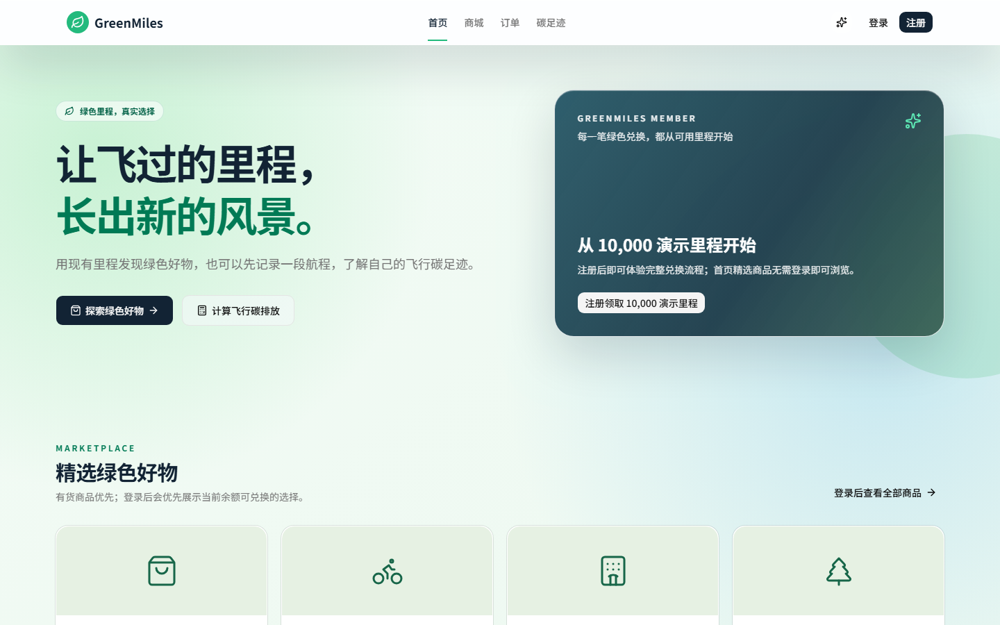

**会员首页 —— 里程余额与个人记录来自数据库（非 Mock 数据）：**

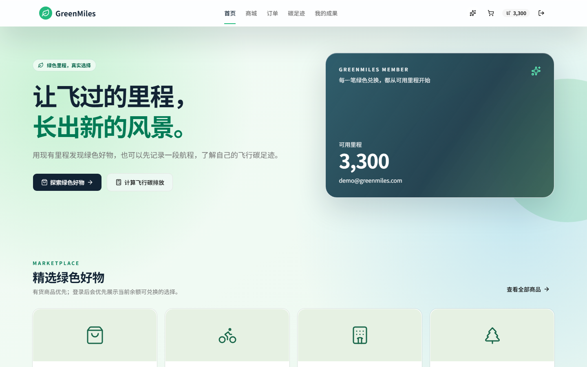

**阶段五 · 认证体验 —— 统一的登录与注册界面：**

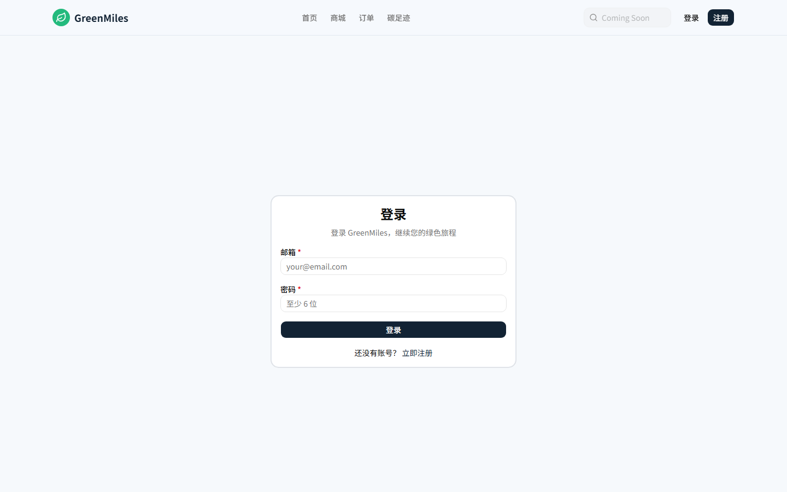

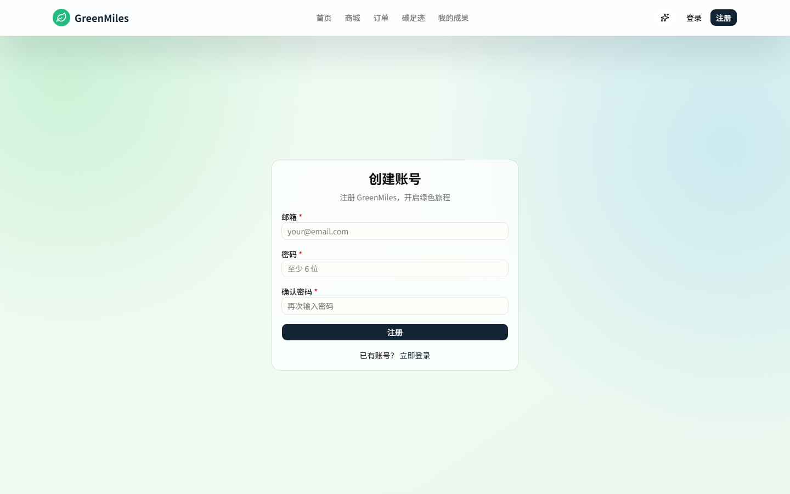

**碳排放计算器：**

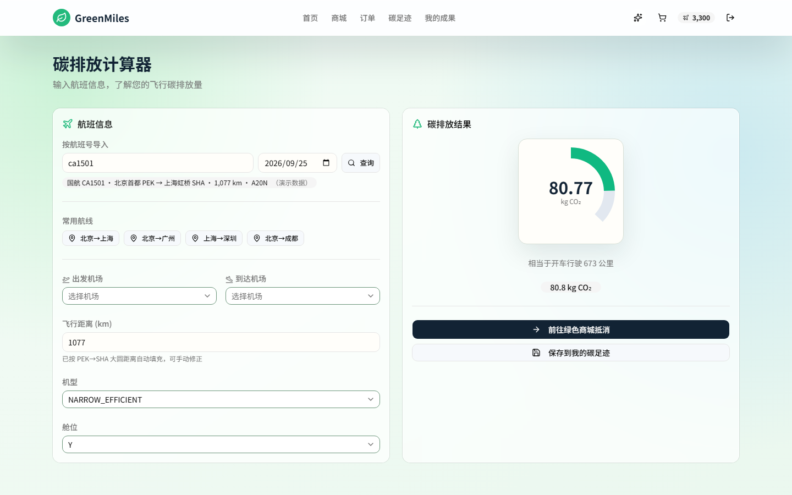

**里程商城：**

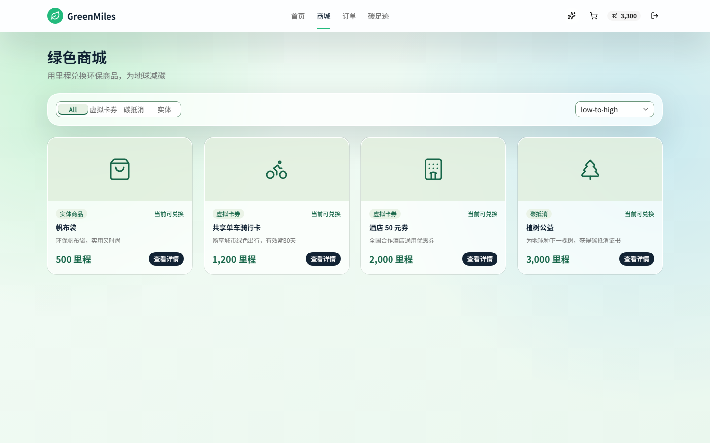

**碳足迹页 —— 月度趋势、季度报告、十年投影与可下载证书：**

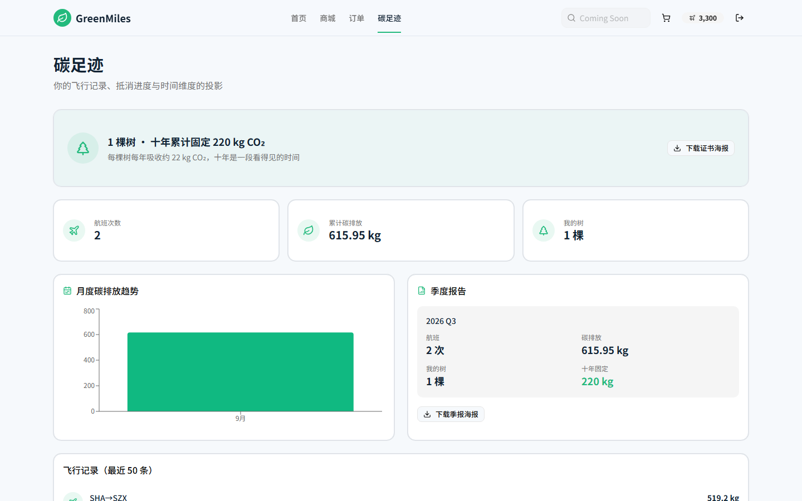

**阶段四 · 我的成果 —— 全量汇总与已解锁里程碑：**

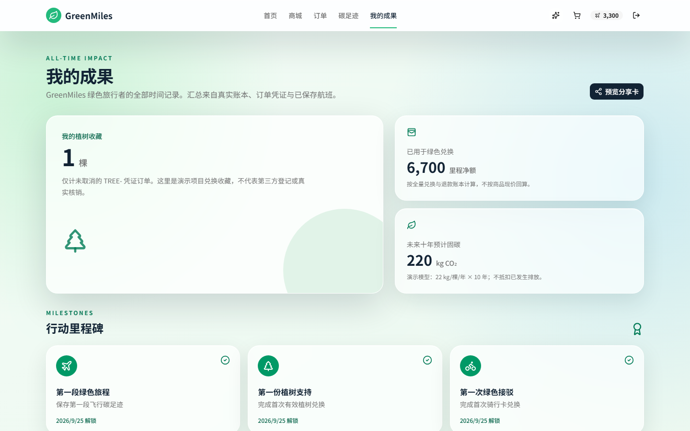

**订单页 —— 兑换记录、取消订单与里程明细账本：**

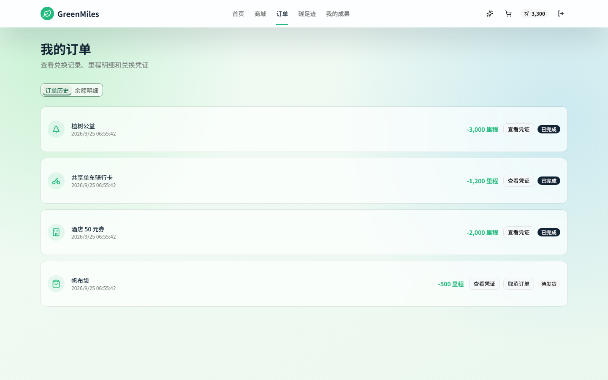

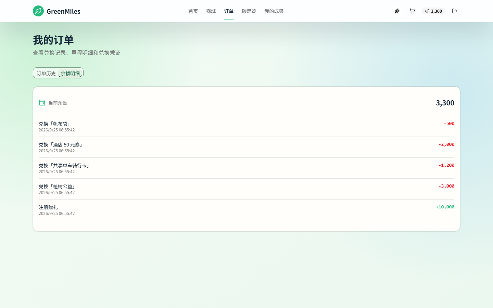

**阶段五 · 管理后台**（`/admin`，管理员口令由 `ADMIN_PASSWORD` 配置）—— 商品管理与订单发货：

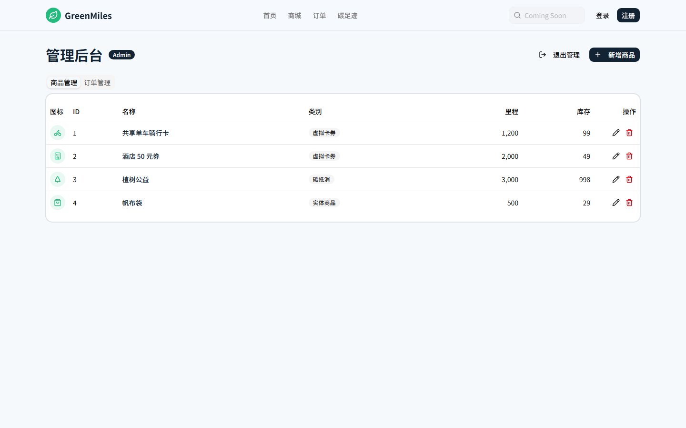

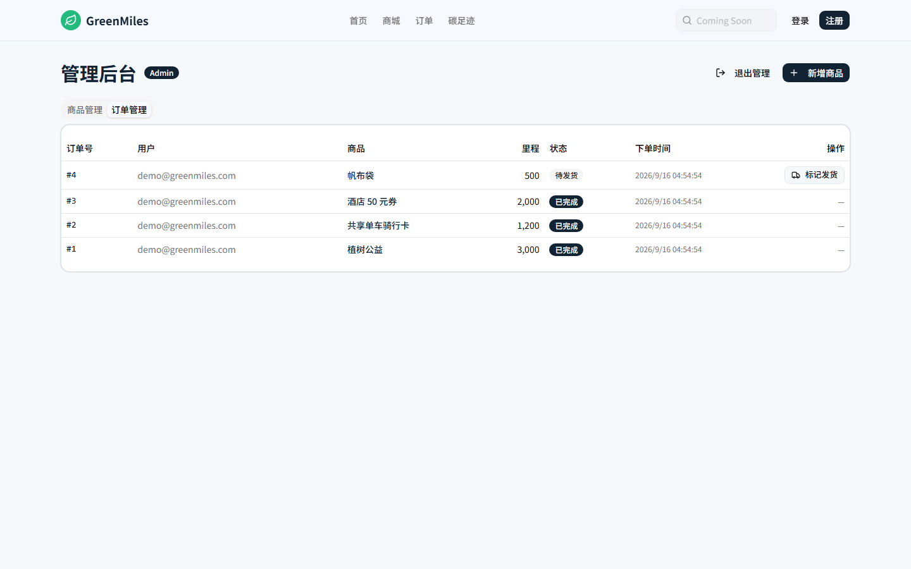

## 功能特性

- 🔐 **用户认证** —— 注册 / 登录 / 登出，JWT（httpOnly Cookie）+ bcrypt 密码加密
- ✨ **全站外观** —— 所有游客、会员与管理路由共用一份持久化玻璃 / 标准材质偏好，并提供减少透明度、减少动态效果降级
- 🧮 **碳排放计算器** —— 输入航班号一键导入（演示数据），或选择起降机场由内置机场坐标自动计算大圆距离；结合机型、舱位得出 CO₂ 排放量及生活化类比（"相当于一棵树 X 天的吸收量"）；支持保存行程到碳足迹历史（服务端复算后再落库，不信任前端数值）
- 🛒 **里程商城** —— 4 类商品（实物、电子券、碳抵消、公益捐赠），含库存、购物车、多数量结算（单笔 1-10 件）与实体商品收货地址表单
- 🎫 **凭证证明** —— 每笔兑换生成带二维码的兑换凭证；实体商品订单进入"待发货"状态并展示收货信息；券码凭证与种树证书可下载分享海报（Canvas 绘制 PNG 含二维码，零新增运行时依赖）
- 📒 **里程账本** —— 注册赠礼 / 兑换 / 退款每笔都留痕于 `miles_transactions`；订单页「余额明细」页签展示最近 50 条流水（正数绿色、负数红色）；老库启动时自动幂等回填历史流水
- ↩️ **订单取消** —— 待发货订单可由本人一键取消：单事务内里程全额退回、库存回补、账本写入退款行；已发放的券码订单有意设计为不可逆
- 🚚 **发货状态机** —— `待发货 → 已发货 → 已完成`，由管理后台订单页驱动；非法转移返回 400；已取消订单从所有统计中剔除
- 🌍 **抵消可信度** —— 碳抵消商品携带项目名称、核证标准、项目年份（可在后台编辑，树商品已种子）；足迹页给出十年固碳投影（每棵树 22 kg/年）
- 📊 **订单与实时看板** —— 历史订单 + `/api/stats` 实时平台指标：累计碳减排（每棵树 22 kg CO₂/年）、里程绿色转化率、兑换次数、我的飞行碳足迹
- 📈 **碳足迹页** —— `/footprint`：月度排放趋势图、最新季度报告卡、我的树与十年投影、最近 50 条飞行记录
- 🌿 **个人影响页** —— `/impact`：将会员行动整理为有数据依据、可分享的影响摘要，加载、空数据与失败状态不会虚构成果
- 🛠️ **管理后台** —— `/admin` 商品增删改查（含抵消项目字段）+ 订单管理，`ADMIN_PASSWORD` 独立会话（与会员账号分离）；已有订单的商品禁止删除
- 🗄️ **零配置 SQLite** —— 首次运行自动建库、建表、写入种子数据

## 技术栈

Next.js 16 · React 19 · Tailwind CSS 4 · shadcn/ui · SQLite (better-sqlite3) · Zustand · Zod · JWT (jose) · Vitest · Testing Library

## 快速开始

前置要求：**Node.js 20+** 和 npm。

```bash
# 1. 克隆项目
git clone https://github.com/TakamiyaHaruka/greenmiles.git
cd greenmiles

# 2. 安装依赖
npm install

# 3. 配置环境变量
cp .env.local.example .env.local
# 编辑 .env.local，设置 JWT_SECRET（可用 `openssl rand -base64 32` 生成）
# 可选：设置 ADMIN_PASSWORD 以启用 /admin 商品管理后台

# 4. 启动
npm run dev
```

打开 <http://localhost:3000>。SQLite 数据库（`greenmiles.db`）会在首次运行时自动创建并写入种子数据，无需手动迁移。

**测试账号：** `test@greenmiles.com` / `password123`（里程余额 10,000）

### 脚本命令

| 命令 | 说明 |
| --- | --- |
| `npm run dev` | 启动开发服务器 <http://localhost:3000> |
| `npm run build` | 生产构建 |
| `npm start` | 启动生产服务器 |
| `npm test` | 运行单元测试（Vitest） |
| `npm run test:coverage` | 单元测试 + 覆盖率报告 |
| `npm run test:e2e` | 运行 Playwright E2E 旅程 —— 自动构建、重置隔离 SQLite 库并在 `:3100` 启动 |
| `npm run lint` | ESLint 检查 |

## 碳排放计算方法

```
CO₂ (kg) = 航距 (km) × 机型系数 (kg/km) × 舱位权重
```

| 机型 | 系数 (kg CO₂/km) | | 舱位 | 权重 |
| --- | --- | --- | --- | --- |
| 窄体高效机型 | 0.075 | | 经济舱 | ×1.0 |
| 窄体标准机型 | 0.090 | | 超级经济舱 | ×1.5 |
| 宽体高效机型 | 0.110 | | 商务舱 | ×2.5 |
| 宽体大型机型 | 0.140 | | 头等舱 | ×4.0 |

以上为演示用的简化系数，并非官方核算方法。每兑换一棵树按 **22 kg CO₂/年** 计入累计碳减排，与计算器的树木类比文案保持一致。飞行距离由 [`src/lib/airports.ts`](src/lib/airports.ts) 内置的机场坐标（Haversine 大圆距离）本地计算；航班号查询走 [`src/lib/flightInfo.ts`](src/lib/flightInfo.ts) 的 Provider 抽象，演示环境使用种子数据（VariFlight / AeroAPI 等真实数据源为商业接口，可作为适配器接入）。完整排放公式见 [`src/lib/carbon.ts`](src/lib/carbon.ts)。

## 测试

- **单元测试（Vitest + Testing Library）**—— 覆盖碳排放引擎、机场坐标与距离、航班 Provider、认证工具、Zod 校验、API 路由、账本迁移、海报 / 足迹函数、路由守卫、外观偏好和 Zustand store。运行 `npm test`。
- **E2E（Playwright）**—— 在独立、全新种子的 SQLite 数据库上验证全站外观偏好、减少透明度 / 动效降级、窄屏认证与管理流程、商城与计算器、注册登录、里程兑换与凭证二维码、订单取消及退款、管理端发货、碳足迹 / 个人影响报告和路由守卫。首次运行先 `npx playwright install chromium`，然后运行 `npm run test:e2e`。

## 项目结构

```
src/
├── app/
│   ├── (pages)/        # 首页、计算器、商城、订单、碳足迹、个人影响、管理后台、登录、注册
│   └── api/            # auth、products、orders（含 cancel）、miles、carbon、stats、admin 接口
├── components/         # 业务组件（含 SharePoster 海报组件）+ shadcn/ui 基础组件
├── lib/                # 数据库、认证、碳排放引擎、机场坐标、航班 Provider、海报/足迹纯函数、Zod 校验
├── stores/             # Zustand 状态（用户、购物车、碳排放、外观偏好）
└── proxy.ts            # JWT 路由守卫（Next.js 16 proxy 约定）
```

## 参与贡献

欢迎提 Issue 和 Pull Request！请阅读 [CONTRIBUTING.md](CONTRIBUTING.md)。

## 许可证

基于 [MIT License](LICENSE) 开源。
