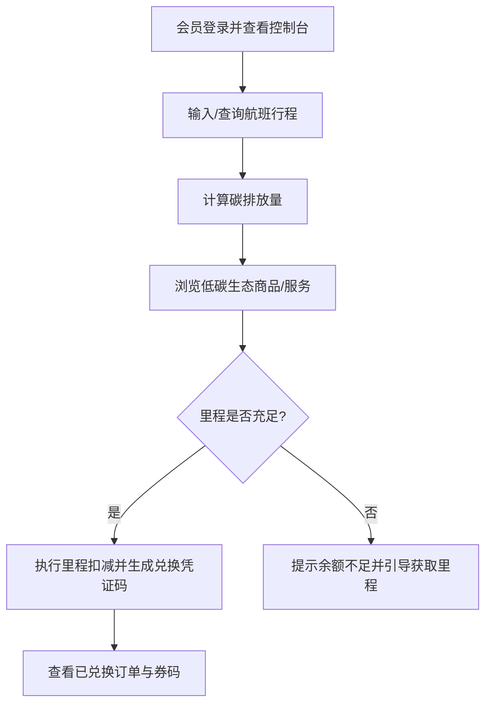

# GreenMiles — 航司绿色里程生态商城 · 产品需求文档

| 版本 | 作者 | 日期 | 状态 | 备注 |
| :--- | :--- | :--- | :--- | :--- |
| v1.0 | BMAD PM Agent | 2026-05-25 | 最终版 | PRD 定稿 |

---

## 1. 项目概述

### 1.1 背景与痛点

传统航空公司会员的里程（Frequent Flyer Miles）往往面临"零碎里程难兑换"、"非航生态链条弱"的问题。同时，随着 ESG（环境、社会和治理）理念的普及，旅客对绿色出行的关注度日益提高。

### 1.2 产品定位

**GreenMiles** 是一个轻量级的绿色里程生态商城系统。它通过计算旅客航班出行的碳足迹，引导旅客使用里程兑换航司生态伙伴（如共享单车、环保酒店、碳抵消植树等）的商品与服务，实现里程资产的循环与非航生态的融合。

### 1.3 项目范围

**Demo 级 / PoC 概念验证**。定位为本地运行或内部演示，不上线生产环境。精力集中在核心的里程扣减事务上，不引入真实支付和真实用户数据。

---

## 2. 用户角色与画像

| 角色 | 描述 | 核心诉求 |
| :--- | :--- | :--- |
| **航司会员 (Member)** | 拥有一定里程积累的普通旅客 | 查看个人碳排、消耗闲置里程、获取低碳环保服务 |
| **系统管理员 (Admin - Mock)** | 运营与财务视角的后台管理者 | 在系统初始化或内存中管理绿色商品、查看里程扣减账单 |

---

## 3. 核心业务流程

---

## 4. 功能需求

### 4.1 用户认证

- **Phase 1**：独立账号体系（注册/登录），支持邮箱或手机号
- **Phase 2**（后续）：对接航司 SSO

### 4.2 碳排放计算

综合考虑 **飞行距离、机型、舱位等级** 三个维度，公式如下：

> **单人飞行碳排放量 (kg) = 飞行距离 (km) × 机型基准排碳系数 (kg/km) × 舱位分摊权重系数**

**机型基准排碳系数：**

| 机型代码 | 代表机型 | 系数 (kg/km) |
| :--- | :--- | :--- |
| `NARROW_EFFICIENT` | A320neo / B737MAX | 0.075 |
| `NARROW_STANDARD` | A320 / B737-800 | 0.090 |
| `WIDE_EFFICIENT` | B787 / A350 | 0.110 |
| `WIDE_LARGE` | B777 / A380 | 0.140 |

**舱位分摊权重系数：**

| 舱位代码 | 舱位名称 | 权重 |
| :--- | :--- | :--- |
| `Y` | 经济舱 | 1.0 |
| `W` | 超级经济舱 | 1.5 |
| `C` | 公务舱 | 2.5 |
| `F` | 头等舱 | 4.0 |

详细规范与计算示例见 [Carbon_Calculation_Spec.md](Carbon_Calculation_Spec.md)。

### 4.3 商品管理

- 后台管理员手动录入绿色商品/服务（名称、描述、所需里程、库存、分类等）
- 支持商品的增删改查

### 4.4 里程兑换

- 核心体验旅程：**Reveal → Offset → Proof**（揭示影响 → 采取行动 → 携带证明）
- 碳排放计算结果页面下方直接解锁推荐抵消方案（单页流式体验，不跳转）
- 碳排放数字永远不孤立出现，旁边必有兑换 CTA，避免 guilt trap
- 余额不足时提示具体差额，提供"可负担商品"筛选

### 4.5 订单与凭证

- 兑换完成后按商品类型生成对应凭证：
  - **共享单车骑行卡**：分配券码
  - **酒店 50 元券**：生成核销二维码
  - **植树公益**：更新碳抵消数据，附带"绿色出行小贴士"小挂件
  - **环保帆布袋**：订单状态置为"待发货"
- 会员可查看历史兑换订单及对应凭证状态

### 4.6 会员控制台

- 里程余额概览（新用户初始化赠送 10,000 里程）
- 碳排放统计（历史航班行程累计）
- 兑换订单列表
- **零状态**：首屏 Hero Card 引导："您还没有绿色出行记录。输入您的下一个航班，开启低碳旅程吧！"
- **Mock 数据看板**：
  - 累计碳减排量（Total CO₂ Offset）
  - 里程绿色转化率（Green Mileage Conversion Rate）

### 4.6 会员控制台

- 里程余额概览
- 碳排放统计（历史航班行程累计）
- 兑换订单列表
- **Mock 数据看板**：
  - 累计碳减排量（Total CO₂ Offset）
  - 里程绿色转化率（Green Mileage Conversion Rate）

### 4.7 商品兑换逻辑（首批 4 种商品）

4 种商品全部实现完整购物流程（浏览、购物车、结算、凭证）：

| 商品名称 | 类别 | 兑换逻辑 |
| :--- | :--- | :--- |
| **共享单车 7 天骑行卡** | 虚拟卡券 | 扣减里程 → 自动分配券码 |
| **环保合作酒店 50 元券** | 虚拟卡券 | 扣减里程 → 动态生成核销二维码 |
| **在阿拉善荒漠种下一棵树** | 碳抵消公益 | 扣减里程 → 更新碳抵消数据 → 附带"绿色出行小贴士"小挂件 |
| **航司联名环保帆布袋** | 实体商品 | 扣减里程 → 确认弹窗内含收货地址表单 → 订单状态置为"待发货" |

---

## 5. 非功能需求

### 5.1 性能

- 预期并发中等：QPS < 50
- 本地运行或内部演示环境

### 5.2 安全与隐私

- 前端展示简单的"隐私协议勾选框"
- 数据库不存储真实身份证、真实手机号，全部使用 Mock 常旅客卡号
- 不引入任何真实三方支付（微信/支付宝等）
- 所有兑换仅消耗虚拟"航司里程"
- "里程+现金"混合支付场景中，现金部分仅做前端交互模拟，不调用任何真实网关

### 5.3 数据

- 是否对接外部数据源待确认（不阻塞 PoC）

---

## 6. 成功指标（KPI）

以 **Mock 数据看板** 形式在控制台展现：

| 指标 | 定义 | 计算方式 |
| :--- | :--- | :--- |
| **累计碳减排量** (Total CO₂ Offset) | 所有用户成功兑换"植树"或"绿色服务"所抵消的 CO₂ 累计总公斤数 | 数据库 SUM 查询 |
| **里程绿色转化率** (Green Mileage Conversion Rate) | 绿色商品消耗的里程占总发行里程的比例 | 数据库 SUM/COUNT 查询 |

---

## 7. 开放问题

- [ ] 是否对接外部数据源（航班实时数据、碳排放因子数据库等）
