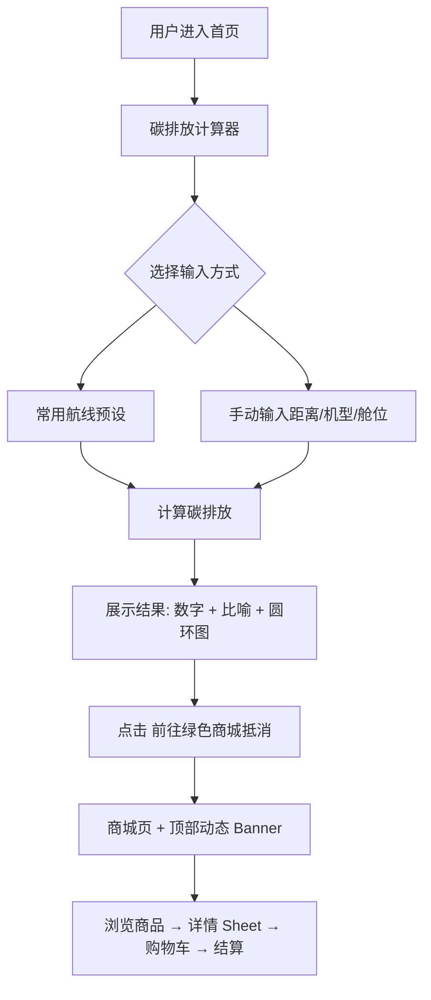
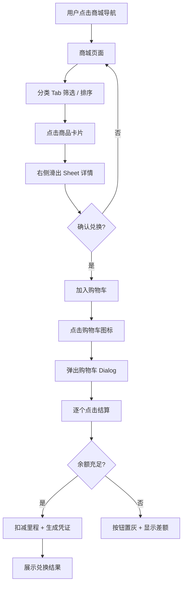
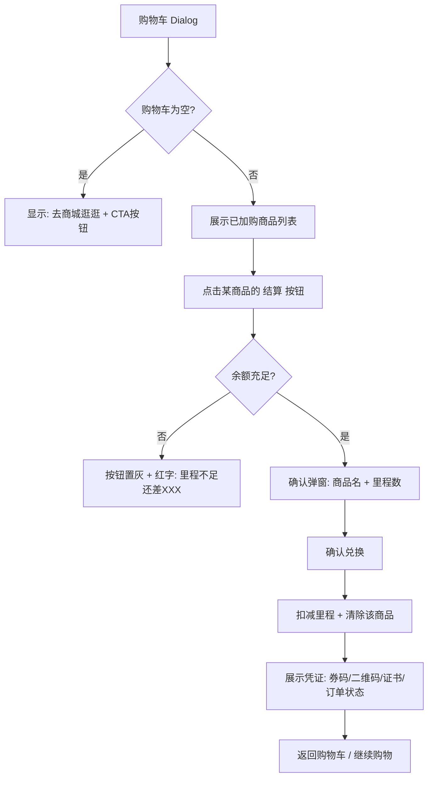
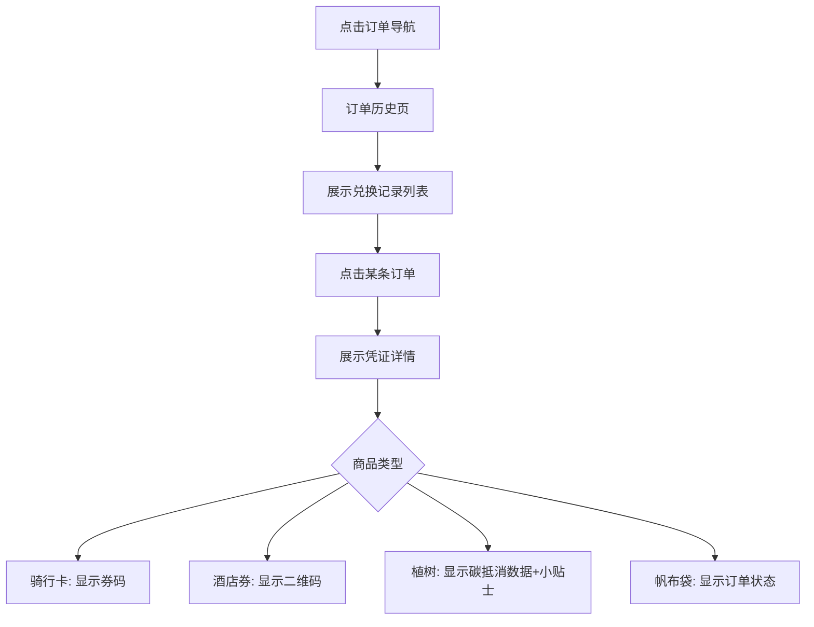

# UX Design Specification — GreenMiles

**Author:** lin
**Date:** 2026-05-25

---

## Executive Summary

### Project Vision

GreenMiles 是一个轻量级绿色里程生态商城系统（Demo/PoC 定位）。通过计算飞行碳足迹，引导航司会员用里程兑换生态伙伴的环保商品与服务，实现里程资产循环与非航生态融合。

### Target Users

| 角色 | 核心诉求 |
| :--- | :--- |
| **航司会员** | 查看个人碳排、消耗闲置里程、获取低碳环保服务 |
| **系统管理员（Mock）** | 管理绿色商品、查看里程扣减账单 |

### Key Design Challenges

1. **商城体验** — 商品货架需要清晰的分类、丰富的卡片信息、顺畅的购物车和结算流程
2. **视觉平衡** — 航司专业感（蓝色系）与环保亲和力（绿色系）的融合，不能偏废
3. **多商品一致性** — 4 种商品兑换逻辑各异（券码/二维码/证书/地址表单），需保持统一的结算体验
4. **PoC 完成度** — 在 Mock 范围内做到"看起来可上线"的视觉和交互品质

### Design Opportunities

1. **里程生态商城** — 将航司里程从"只能换机票"扩展到绿色生态商品，商业模式创新
2. **碳排放工具** — 商城内的差异化工具，帮助用户了解飞行碳排放，引导绿色消费
3. **KPI 看板** — 累计碳减排量 + 里程绿色转化率，让环保价值一目了然

## Core User Experience

### Defining Experience

**产品形态：航司里程生态商城（平台/商城）**

GreenMiles 是一个完整的商城平台，核心是商品货架和购物流程。碳排放计算器是商城内的一个工具模块，不是产品主体。

**用户行为流程：**

```
算碳排放 → 进入商城 → 分类浏览商品 → 加入购物车 → 逐个结算（用里程支付）
```

**商城核心体验：**

1. **商品货架** — 按分类展示绿色生态商品（虚拟卡券、碳抵消公益、实体商品），用户浏览、挑选、加入购物车
2. **购物车** — 汇总待兑换商品，支持逐个结算
3. **里程结算** — 每个商品用里程支付，校验余额，扣减里程，生成对应凭证
4. **碳排放工具** — 商城内的辅助工具，帮助用户了解飞行碳排放，引导绿色消费

### Product Architecture

**商城是产品主体，计算器是商城内的工具。**

- **商城**：商品分类浏览、购物车、逐个结算 — 这是用户的主要活动场所
- **碳排放计算器**：嵌入商城的工具模块，用于了解飞行碳排放，可引导用户关注绿色商品
- **个人中心**：里程余额、兑换订单、碳排放统计

### Platform Strategy

- Web 端：Next.js + Tailwind CSS
- 鼠标/键盘为主，响应式适配移动端
- 无需离线功能（PoC 范围）
- 标准商城架构：首页 → 商品列表 → 购物车 → 结算

### Effortless Interactions

1. **商品浏览** — 分类标签筛选 + 排序下拉 + 搜索占位符（Coming Soon），卡片用渐变色块+Lucide图标
2. **商品详情** — 点击卡片，右侧滑出 Sheet 抽屉（shadcn/ui Sheet），展示条款和兑换按钮
3. **购物车** — 导航栏常驻购物车图标+角标，点击弹出 Dialog 面板，空状态引导回商城
4. **里程结算** — 购物车内逐个结算，余额不足时按钮置灰+显示差额
5. **上下文推荐** — 从计算器进入商城时，顶部显示动态 Banner："抵消您本次飞行的 XXXkg 碳排"
6. **零状态引导** — 新用户初始赠送 10,000 里程，首屏展示商品推荐

### Critical Success Moments

1. **商品发现** — 分类筛选让用户快速找到感兴趣的商品
2. **详情决策** — Sheet 抽屉展示条款和价值，用户做出兑换决定
3. **结算完成** — 购物车弹窗内完成结算，凭证即时呈现
4. **订单历史** — 可查看历史订单和凭证（券码/二维码/证书）

### Experience Principles

| # | 原则 | 说明 |
|---|------|------|
| 1 | **商城为主体** | 商品货架和购物流程是产品核心，计算器是辅助工具 |
| 2 | **上下文推荐** | 从计算器进入商城时，顶部 Banner 关联碳排数据，引导绿色消费 |
| 3 | **Sheet 详情** | 商品详情用右侧滑出抽屉，不跳转页面，保持商城连续性 |
| 4 | **结算要干脆** | 购物车弹窗内完成结算，余额不足时明确提示差额 |

### Product Scope Decisions（开发清单）

**核心主干（100% 落实）：**

1. **导航栏** — 右侧常驻里程余额 + 购物车图标（带角标）
2. **碳排放计算器** — 输入航班数据 → 输出 CO₂ 排量（带比喻） → "前往绿色商城抵消"按钮
3. **商城页面** — 顶部动态 Banner（检测到计算器传入碳排数据时显示）+ 分类 Tab 栏（All/虚拟/碳抵消/实体）+ 排序下拉 + 搜索框（禁用，Coming Soon）
4. **商品详情 Sheet** — 点击卡片，右侧滑出 Sheet 抽屉：虚拟商品展示兑换条款，实体商品展示收货地址输入框
5. **购物车 Dialog** — 点击导航栏购物车图标弹出：已加购商品、总消耗里程、余额不足时按钮置灰+差额提示、结算成功后扣减里程清空购物车
6. **订单历史** — 展示过往订单，点击查看虚拟券码或植树证书

**极简模拟（降维开发）：**

- **商品卡片图片**：渐变色块 + 大号 Lucide Icon（`Bike`/`Hotel`/`TreePine`/`ShoppingBag`），不使用位图
- **搜索栏**：占位符显示"Coming Soon"，不实现搜索逻辑
- **余额不足**：结算按钮置灰 + 红色小字提示差额，不做动态商品过滤

**绿色概念定位**：通过碳排放计算和绿色商品概念为非航生态商城引流，绿色是营销手段，商城是目的地

## Desired Emotional Response

### Primary Emotional Goals

**情感弧线：发现 → 挑选 → 满足 → 累积**

用户使用 GreenMiles 的核心情感旅程是一个典型的商城体验：

```
"有什么好东西可以换？" → "这个不错，里程够不够？" → "换到了！" → "我已经换了不少好东西了"
```

### Emotional Journey Mapping

| 阶段 | 用户状态 | 设计目标 |
|------|----------|----------|
| **首次进入** | 好奇、探索 | 首页展示商品推荐和里程余额，让用户快速了解"我能换什么" |
| **浏览商品** | 兴趣、挑选 | 分类清晰、卡片信息丰富，让用户在浏览中发现感兴趣的商品 |
| **加入购物车** | 期待、规划 | 购物车汇总待兑换商品，用户可以规划自己的兑换组合 |
| **结算完成** | 满足、收获 | 凭证/券码/证书即时呈现，兑换结果明确 |
| **累计消费** | 成就、认同 | 碳减排统计和兑换历史展示用户的绿色消费轨迹 |

### Micro-Emotions

| 正向目标 | 负向规避 |
|----------|----------|
| **发现感** — "原来里程可以换这些好东西" | **困惑** — 商品分类不清，不知道去哪里找 |
| **掌控感** — "我的里程我做主，想换什么换什么" | **挫败** — 里程不够时感到被拒绝 |
| **满足感** — "换到了想要的东西" | **空虚** — 兑换后没有明确的结果反馈 |
| **累积感** — "我已经换了不少，碳减排量在增长" | **遗忘** — 之前的兑换没有记录可查 |

### Design Implications

| 情感 | UX 设计方案 |
|------|------------|
| 发现感 | 商品分类导航 + 卡片网格，信息丰富的商品展示 |
| 掌控感 | 里程余额常驻显示、购物车管理、逐个结算 |
| 满足感 | 兑换成功弹窗 + 即时凭证呈现 |
| 累积感 | 个人中心：兑换历史 + 碳减排统计 |

### Emotional Design Principles

1. **商品是主角** — 卡片设计突出商品价值和所需里程，让用户在浏览中产生兑换意愿
2. **结算要干脆** — 选品→确认→结果，3 步完成，不拖泥带水
3. **结果要明确** — 每次兑换都有即时的凭证反馈（券码/二维码/小贴士/订单状态）
4. **积累要可见** — 碳减排量和兑换历史让用户看到自己的绿色消费轨迹
5. **绿色是引流** — 碳排放计算和绿色概念为商城引流，植树的小挂件是锦上添花，不是产品核心

## UX Pattern Analysis & Inspiration

### Inspiring Products Analysis

| 产品 | 借鉴点 |
|------|--------|
| **航司里程商城**（国航知音、南航明珠） | 里程余额常驻显示、商品卡片网格、兑换确认流程 |
| **碳足迹计算器**（MyClimate） | 航线输入交互、结果可视化、排放因子透明度 |
| **Too Good To Go** | 环保行动的情感化设计、"你拯救了 X kg 食物"的成就感反馈 |
| **信用卡积分商城** | 积分兑换的一键体验、兑换成功弹窗 |

### Transferable UX Patterns

| 类别 | 模式 | 应用场景 |
|------|------|----------|
| **导航** | 里程余额常驻导航栏右上角 | 用户随时感知可用里程 |
| **交互** | 常用航线预设快捷选择 | 碳排放计算器减少输入摩擦 |
| **交互** | 兑换确认弹窗 + 即时结果 | 所有商品统一的兑换节奏 |
| **视觉** | 证书/徽章的卡片式展示 | 成就墙的证书收藏展示 |
| **反馈** | 成功状态的全屏覆盖 | 植树兑换后的证书弹出 |

### Anti-Patterns to Avoid

| 反模式 | 问题 | 规避方案 |
|--------|------|----------|
| 多页跳转兑换流程 | 打断节奏，用户流失 | 单页流式体验，弹窗完成 |
| 纯数字无语境 | 用户无法感知碳排放含义 | 每个数字配直觉化比喻 |
| 空状态无引导 | 新用户不知从何开始 | Hero Card + 初始化里程 |
| 过度动画 | PoC 范围内增加复杂度 | 仅在证书弹出时使用简单过渡 |

### Design Inspiration Strategy

- **采纳**：航司商城的余额常驻 + 单页流式兑换 + 证书卡片展示
- **改造**：碳足迹计算器的输入方式 → 加入常用航线预设；Too Good To Go 的成就感反馈 → 适配绿色证书场景
- **规避**：多页跳转、纯数字展示、空状态死胡同

## Design System Foundation

### Design System Choice

**Tailwind CSS + shadcn/ui + Recharts + Framer Motion**

| 层级 | 技术 | 职责 |
|------|------|------|
| 结构层 | shadcn/ui（基于 Radix UI） | 按钮、卡片、弹窗、表单、标签等基础组件 |
| 数据可视化层 | Recharts | 碳排放圆环图、KPI 图表 |
| 情感层 | Framer Motion | 证书弹出动画、页面过渡、微交互 |
| 样式层 | Tailwind CSS | 布局、间距、色彩、响应式 |

### Rationale for Selection

1. **AI 代码生成友好** — Tailwind 类名在 LLM 训练数据中覆盖极高，生成准确率高
2. **源码完全可控** — shadcn/ui 组件复制到项目中，无版本锁定，无升级焦虑
3. **无障碍内置** — 基于 Radix UI，Dialog/Sheet 等组件自带焦点管理、键盘操作、ARIA 属性
4. **生态成熟** — Recharts + shadcn/ui 是 React 社区最常见的图表+组件组合

### Implementation Approach

**组件清单（10 个核心组件）：**

| 组件 | 用途 |
|------|------|
| `button.tsx` | CTA 按钮、兑换按钮 |
| `card.tsx` | 商品卡片、KPI 瓷砖、证书卡片 |
| `dialog.tsx` | 4 种兑换弹窗、证书全屏弹出 |
| `badge.tsx` | 环保徽章、状态标签 |
| `tabs.tsx` | 控制台分区切换 |
| `separator.tsx` | 视觉分隔线 |
| `input.tsx` | 碳计算器输入框、地址表单 |
| `select.tsx` | 机型/舱位下拉选择 |
| `table.tsx` | KPI 数据表格 |
| `sheet.tsx` | 移动端导航抽屉（可选） |

**额外依赖：**

| 依赖 | 用途 |
|------|------|
| `recharts` | 碳排放圆环图 |
| `framer-motion` | 证书弹出动画、页面过渡 |
| `qrcode.react` | 酒店券二维码生成（Mock 路径可选） |
| `lucide-react` | 图标库（树、飞机、叶子等） |

### Customization Strategy

**色彩主题（Tailwind 配置）：**

| Token | 色值 | 用途 |
|-------|------|------|
| `--primary` | `#0A2540`（航司蓝） | 导航栏、标题、系统基调 |
| `--accent` | `#10B981`（生态绿） | CTA 按钮、碳数据、证书背景 |
| `--background` | `#F8FAFC`（灰白） | 页面大背景 |
| `--warning` | `#F59E0B`（落日橙） | 高碳排警告、促销标签 |

**圆角规范：** 卡片 `rounded-2xl`，按钮 `rounded-lg`，徽章 `rounded-full`

**阴影规范：** 统一 `shadow-sm`（微弱投影）

**边框规范（强制）：** 所有卡片必须加 `border border-[#E2E8F0]`（浅灰边框）。原因：`#FFFFFF` 卡片在 `#F8FAFC` 背景上色差极微，阳光下手机屏幕或色弱用户无法分辨卡片边界。

**毛玻璃效果：** Dashboard 卡片使用 `backdrop-blur-md bg-white/60 border border-[#E2E8F0]`

**注意事项：**
- CSS 变量主题系统（`hsl(var(--primary))` 语法）
- `cn()` 工具函数（`clsx` + `tailwind-merge`）用于条件类合并
- 表单集成引入 `react-hook-form` + `zod`（PoC 可接受）
- `tailwindcss-animate` 提供 Dialog 动画

## Visual Design Foundation

### Color System

| Token | 色值 | 用途 | 语义 |
|-------|------|------|------|
| `primary` | `#0A2540`（航司蓝） | 导航栏、标题、系统基调 | 品牌、信赖 |
| `accent` | `#10B981`（生态绿） | CTA 按钮、碳数据、里程相关 | 环保、行动 |
| `background` | `#F8FAFC`（冷灰白） | 页面大背景 | 干净、舒适 |
| `card` | `#FFFFFF`（纯白） | 卡片背景 | 内容容器 |
| `border` | `#E2E8F0`（浅灰） | 卡片边框、分隔线 | 结构、边界 |
| `foreground` | `#0F172A`（深灰） | 正文文字 | 可读性 |
| `muted` | `#64748B`（中灰） | 次要文字、说明 | 辅助信息 |
| `warning` | `#F59E0B`（落日橙） | 余额不足提示、促销标签 | 注意、优惠 |

### Typography System

| 层级 | 字号 | 字重 | 用途 |
|------|------|------|------|
| `h1` | 30px | 700 | 页面标题 |
| `h2` | 24px | 600 | 区块标题 |
| `h3` | 20px | 600 | 卡片标题 |
| `body` | 16px | 400 | 正文 |
| `small` | 14px | 400 | 说明文字、标签 |
| `caption` | 12px | 400 | 辅助信息 |

- 字体栈：`Inter, -apple-system, BlinkMacSystemFont, "Segoe UI", sans-serif`
- 行高：正文 1.6，标题 1.3
- 中文适配：系统字体优先，确保中文渲染质量

### Spacing & Layout Foundation

| 规范 | 值 | 用途 |
|------|------|------|
| 基础单位 | 4px | 所有间距的倍数基础 |
| 卡片内边距 | 24px (`p-6`) | 卡片内容区域 |
| 区块间距 | 32px (`space-y-8`) | 页面区块之间的间隔 |
| 网格列 | `grid-cols-1 md:grid-cols-2 lg:grid-cols-4` | 商品卡片网格 |
| 最大宽度 | 1280px (`max-w-7xl`) | 内容区域最大宽度，居中 |

### Accessibility Considerations

| 项目 | 规范 |
|------|------|
| **卡片边框（强制）** | 所有卡片必须加 `border border-[#E2E8F0]`，确保白色卡片在 `#F8FAFC` 背景上可见（阳光下/色弱用户） |
| **色彩对比度** | 正文文字 `#0F172A` 在 `#F8FAFC` 背景上对比度 > 15:1，远超 WCAG AA 要求 |
| **绿色按钮对比度** | `#10B981` 按钮上使用白色文字，对比度约 4.5:1，满足 AA 标准 |
| **圆角与阴影** | 卡片 `rounded-2xl shadow-sm`，按钮 `rounded-lg`，徽章 `rounded-full` |
| **毛玻璃效果** | Dashboard 卡片 `backdrop-blur-md bg-white/60 border border-[#E2E8F0]`，仅用于强调性卡片 |

## Design Direction Decision

### Chosen Direction: Neo-Minimalist Mall

新极简商城风格 — 标准商城架构 + 航司蓝/生态绿配色 + 卡片化商品展示。

### Page Structure

| 页面 | 核心内容 |
|------|----------|
| **首页/仪表盘** | 里程余额、碳排放计算器入口、商品推荐、KPI 看板 |
| **商城页** | 动态 Banner（上下文推荐）+ 分类 Tab + 排序 + 商品卡片网格 |
| **购物车** | 弹窗 Dialog 面板，逐个结算 |
| **订单历史** | 兑换记录、凭证查看 |

### Navigation Architecture

- **顶部导航栏**：Logo（绿叶+小飞机）+ 主导航（首页/商城/订单）+ 里程余额（右上角）+ 购物车图标+角标
- **最大宽度**：1280px，居中

### Product Card Design

```
┌─────────────────────────────┐
│  [渐变色块 + Lucide Icon]    │  ← 商品图（渐变背景 + 大号图标）
│                              │
│  [虚拟卡券]                  │  ← 分类标签（Badge）
│  共享单车 7 天骑行卡          │  ← 商品名称
│  7 天无限骑行               │  ← 价值钩子
│  1,200 里程                  │  ← 所需里程（绿色）
│                              │
│  [立即兑换]                  │  ← CTA 按钮
└─────────────────────────────┘
```

- 背景：`#FFFFFF`，边框：`border border-[#E2E8F0]`（强制），圆角：`rounded-2xl`，阴影：`shadow-sm`

### Design Rationale

- 标准商城架构确保用户有熟悉的购物心智模型
- 渐变色块+Lucide Icon 替代位图，降低设计成本且视觉统一
- Sheet 抽屉替代独立详情页，省路由复杂度
- 上下文推荐 Banner 保留计算器到商城的情感联结

## User Journey Flows

### 旅程 1：碳排放计算 → 商城兑换



### 旅程 2：直接浏览商城 → 兑换



### 旅程 3：购物车结算



### 旅程 4：订单历史查看



### Journey Patterns

| 模式 | 说明 |
|------|------|
| **入口** | 两个入口：首页计算器 / 商城导航 |
| **详情** | Sheet 抽屉，不跳转页面 |
| **结算** | 购物车 Dialog 内逐个结算 |
| **凭证** | 结算后即时展示，订单历史可回看 |
| **余额不足** | 按钮置灰 + 差额提示，不阻断浏览 |

## Component Strategy

### Design System Components（shadcn/ui）

| 组件 | 用途 |
|------|------|
| `button` | CTA 按钮、兑换按钮、结算按钮 |
| `card` | 商品卡片、KPI 瓷砖 |
| `dialog` | 购物车弹窗、确认弹窗 |
| `sheet` | 商品详情右侧滑出抽屉 |
| `badge` | 分类标签、角标 |
| `tabs` | 分类筛选 Tab 栏 |
| `select` | 排序下拉、机型/舱位选择 |
| `input` | 碳计算器输入框、地址表单 |
| `separator` | 视觉分隔线 |
| `table` | KPI 数据表格、订单历史 |

### Custom Components

| 组件 | 用途 | 设计要点 |
|------|------|----------|
| `ProductCard` | 商品卡片 | 渐变色块 + Lucide Icon + 分类标签 + 名称 + 价值钩子 + 里程价格 + CTA |
| `CarbonCalculator` | 碳排放计算器 | 常用航线预设 + 手动输入 + 实时结果 + 比喻文字 + 圆环图 + CTA |
| `ContextBanner` | 上下文推荐 Banner | 从计算器传入碳排数据，显示"抵消您本次飞行的 XXXkg 碳排" |
| `VoucherDisplay` | 凭证展示 | 券码文本 / 二维码 / 碳抵消数据 / 订单状态 |
| `MilesBalance` | 里程余额显示 | 导航栏右上角常驻，格式化数字 |

### Component Specifications

**ProductCard：**
- 状态：默认 / hover（阴影增强）/ 已兑换（灰色遮罩 + "已兑换"标签）
- 变体：4 种商品类型共用卡片结构，渐变色和 Icon 不同
- 无障碍：卡片整体可点击，按钮有 `aria-label`

**CarbonCalculator：**
- 状态：空输入 / 部分输入 / 完整输入（实时计算）/ 结果展示
- 变体：预设航线模式 / 手动输入模式
- 无障碍：表单标签、输入校验提示

**VoucherDisplay：**
- 变体：券码文本（可复制）/ 二维码图片 / 碳抵消数据卡片 / 订单状态标签
- 无障碍：券码有复制按钮、二维码有 alt 文本

### Implementation Roadmap

| 阶段 | 组件 | 优先级 |
|------|------|--------|
| **Phase 1** | 导航栏、ProductCard、商城页面（Tab+Grid） | 核心购物流程 |
| **Phase 2** | Sheet（商品详情）、Dialog（购物车）、VoucherDisplay | 结算流程 |
| **Phase 3** | CarbonCalculator、ContextBanner、订单历史页 | 工具+历史 |
| **Phase 4** | MilesBalance 动画、KPI 看板 | 增强体验 |

## UX Consistency Patterns

### Button Hierarchy

| 层级 | 样式 | 场景 |
|------|------|------|
| **Primary（主行动）** | `bg-[#10B981] text-white rounded-lg` | "立即兑换"、"前往绿色商城抵消"、"确认兑换" |
| **Secondary（次行动）** | `bg-transparent border border-[#E2E8F0] text-[#0F172A]` | "继续购物"、"返回商城"、"查看详情" |
| **Ghost（文字链）** | `text-[#10B981] hover:underline` | "查看全部订单"、"了解更多" |
| **Disabled（禁用）** | `bg-gray-200 text-gray-400 cursor-not-allowed` | 余额不足时的"结算"按钮 |

**规则：**
- 一个视图内只有一个 Primary 按钮
- 所有 CTA 按钮使用生态绿 `#10B981`，强化"绿色行动"语义
- 余额不足时 Primary 按钮降级为 Disabled，下方显示红色差额提示

### Feedback Patterns

| 场景 | 反馈方式 | 组件 |
|------|----------|------|
| **兑换成功** | Dialog 弹窗 + 凭证展示（券码/二维码/证书/订单状态） | `dialog.tsx` |
| **里程扣减** | 导航栏余额数字更新（可选 Framer Motion 数字滚动） | `MilesBalance` 组件 |
| **余额不足** | 按钮置灰 + 红色小字 `"里程不足（还差 XXX 里程）"` | 行内文本 |
| **加入购物车** | 导航栏购物车角标 +1，可选 Toast 提示 | `badge.tsx` 角标 |
| **地址表单校验** | 输入框下方红色错误文字，zod 校验 | `input.tsx` + `zod` |

**规则：**
- 成功反馈用 Dialog 覆盖（不跳转页面），失败反馈用行内文字
- 碳排放结果旁必有 CTA 按钮，避免 Guilt Trap
- 凭证展示后提供"继续购物"和"查看订单"两个出口

### Form Patterns

| 表单 | 字段 | 校验 | 布局 |
|------|------|------|------|
| **碳排放计算器** | 距离（km）、机型（Select）、舱位（Select） | 距离 > 0，机型/舱位必选 | 垂直堆叠，常用航线预设在上方 |
| **收货地址** | 姓名、手机号、详细地址 | 姓名非空，手机号格式，地址非空 | Dialog 内垂直堆叠 |
| **搜索框** | 禁用状态 | — | 导航栏内，placeholder "Coming Soon" |

**规则：**
- 所有表单使用 `react-hook-form` + `zod` 进行校验
- 必填字段用 `*` 标记
- 校验错误在失焦（onBlur）时显示，提交时二次校验
- 地址表单嵌入帆布袋兑换 Dialog 内，不单独成页

### Navigation Patterns

| 元素 | 行为 | 位置 |
|------|------|------|
| **主导航** | 首页 / 商城 / 订单 — 高亮当前页 | 顶部导航栏左侧 |
| **里程余额** | 常驻显示，格式化数字（如 `10,000`） | 导航栏右上角 |
| **购物车图标** | 常驻，角标显示数量，点击弹出 Dialog | 导航栏右侧，余额左边 |
| **分类 Tab** | All / 虚拟卡券 / 碳抵消 / 实体 — 切换商品列表 | 商城页面顶部 |
| **排序下拉** | 里程从低到高 / 里程从高到低 | 商城页面，Tab 栏右侧 |
| **上下文 Banner** | 从计算器进入商城时显示，可关闭 | 商城页面顶部，Tab 栏上方 |

**规则：**
- 导航栏固定在顶部（`sticky top-0`），`backdrop-blur-md` 毛玻璃效果
- 当前页 Tab 用 `accent` 色下划线标识
- 购物车角标为空时不显示数字，非空时显示商品数量

### Modal & Overlay Patterns

| 类型 | 组件 | 用途 | 关闭方式 |
|------|------|------|----------|
| **商品详情 Sheet** | `sheet.tsx`（右侧滑出） | 展示商品条款/地址表单 + "加入购物车"按钮 | 点击 X / 点击遮罩 / ESC |
| **购物车 Dialog** | `dialog.tsx`（居中弹窗） | 已加购商品列表 + 逐个结算 | 点击 X / 点击遮罩 / ESC |
| **兑换确认 Dialog** | `dialog.tsx`（居中弹窗） | "确认用 XXX 里程兑换 YYY？" | 确认 / 取消 |
| **凭证展示 Dialog** | `dialog.tsx`（居中弹窗） | 兑换成功后的券码/二维码/证书 | 关闭 / 继续购物 |

**规则：**
- Sheet 用于详情浏览（不打断商城上下文），Dialog 用于操作确认和结果展示
- 所有弹窗支持 ESC 关闭和遮罩点击关闭
- 凭证弹窗关闭后回到购物车 Dialog，购物车 Dialog 关闭后回到商城页面
- 打开弹窗时焦点自动移入（Radix UI 内置）

### Empty & Loading States

| 场景 | 内容 | 引导 |
|------|------|------|
| **购物车为空** | 空购物车图标 + "购物车空空如也" | CTA 按钮："去商城逛逛" → 跳转商城页 |
| **订单历史为空** | 空文件夹图标 + "暂无兑换记录" | CTA 按钮："去商城看看" → 跳转商城页 |
| **首次使用（零状态）** | Hero Card + 里程余额 10,000 | "您还没有绿色出行记录。输入您的下一个航班，开启低碳旅程吧！" |
| **加载中** | Spinner + "加载中..." | 骨架屏（PoC 可选） |

**规则：**
- 空状态必须有引导 CTA，不允许死胡同
- 零状态 Hero Card 仅在首次访问时显示（localStorage 标记）
- 加载状态使用统一的 Spinner 组件

### Search & Filtering Patterns

| 功能 | 实现 | 状态 |
|------|------|------|
| **分类 Tab 筛选** | 前端数组 `products.filter(p => category === selected)` | 已实现 |
| **排序** | 前端数组 `products.sort((a,b) => a.price - b.price)` | 已实现 |
| **搜索框** | 禁用，placeholder "Coming Soon" | 占位符 |
| **上下文推荐** | URL state / Context 传递碳排数据，顶部 Banner 显示 | 已实现 |

**规则：**
- 分类筛选和排序为纯前端操作，不需要后端查询
- Tab 切换时商品列表带 Framer Motion `layoutId` 动画过渡
- 搜索框保持视觉存在但功能禁用，为未来扩展预留

## Responsive Design & Accessibility

### Scope Decision

**当前阶段优先桌面端 Web，暂不做移动端适配。** 移动端响应式和无障碍细节留待后续迭代处理。

以下为桌面端基线规范和已识别的移动端待处理事项。

### Desktop Layout

| 断点 | 布局 | 用途 |
|------|------|------|
| `≥ 1024px`（lg） | 四列商品网格，导航栏水平展开 | 主开发环境 |
| `≥ 1280px`（xl） | 内容区 `max-w-7xl` 居中 | 大屏适配 |

**核心布局规则：**
- 商品卡片网格：`grid-cols-1 md:grid-cols-2 lg:grid-cols-4`
- 导航栏固定顶部（`sticky top-0`），`backdrop-blur-md` 毛玻璃效果
- 所有弹窗（Sheet / Dialog）居中展示，宽度 `max-w-lg`（详情 Sheet）或 `max-w-md`（购物车 Dialog）
- 内容区最大宽度 1280px，居中

### Breakpoint Strategy

使用 Tailwind CSS 默认断点：

| 断点 | 前缀 | 宽度 | GreenMiles 用途 |
|------|------|------|-----------------|
| 默认 | — | 0 - 639px | 手机竖屏（PoC 阶段不覆盖） |
| `sm` | `sm:` | ≥ 640px | 手机横屏（PoC 阶段不覆盖） |
| `md` | `md:` | ≥ 768px | 平板，双列商品网格（PoC 阶段不覆盖） |
| `lg` | `lg:` | ≥ 1024px | 桌面，四列商品网格（主断点） |
| `xl` | `xl:` | ≥ 1280px | 大屏，内容区居中 |

### Accessibility Strategy

**目标：WCAG AA 级别。** 基于 shadcn/ui（Radix UI）的无障碍基线，确保桌面端基本可用。

| 项目 | 规范 | 实现方式 |
|------|------|----------|
| **色彩对比度** | 正文 ≥ 4.5:1，大字 ≥ 3:1 | `#0F172A` on `#F8FAFC` ≈ 15:1 |
| **卡片边框（强制）** | `border border-[#E2E8F0]` | 白卡在灰白背景上必须有边框 |
| **键盘导航** | 所有交互元素可 Tab 聚焦 | Radix UI 内置焦点管理 |
| **焦点指示器** | 聚焦环 `ring-2 ring-[#10B981] ring-offset-2` | Tailwind focus-visible |
| **触控目标** | 最小 44×44px | 按钮 `min-h-[44px] min-w-[44px]` |
| **ARIA 标签** | 图标按钮必须有 `aria-label` | 如购物车按钮 `aria-label="购物车"` |
| **语义化 HTML** | 使用 `nav`、`main`、`section`、`article` | shadcn/ui 组件内置 |

### Testing Strategy

| 类别 | 方法 | 范围 |
|------|------|------|
| **浏览器** | Chrome、Firefox、Safari、Edge | 主流浏览器 |
| **键盘导航** | 仅用 Tab + Enter + ESC 操作 | 全流程：浏览→详情→购物车→结算 |
| **色彩对比** | Chrome Lighthouse Accessibility 审计 | 目标分数 ≥ 90 |

### Implementation Guidelines

**桌面端开发：**
- 使用相对单位 `rem` / `%`，避免固定 `px`
- 图标使用 Lucide SVG，自动缩放
- 导航栏 `sticky top-0`，`backdrop-blur-md` 毛玻璃
- 所有 shadcn/ui 组件基于 Radix UI，内置 ARIA 和焦点管理
- 图标按钮加 `aria-label`（购物车、关闭按钮等）
- 颜色不作为唯一信息载体（余额不足用红色文字 + "不足"文字双重提示）

### Deferred — Mobile Responsive & Accessibility

以下问题已识别，留待移动端适配阶段处理：

| # | 问题 | 建议 | 优先级 |
|---|------|------|--------|
| M1 | 购物车 Dialog 在移动端应切换为底部 Sheet | 用 CSS 控制布局，JS 层面保持单一组件树（Winston 建议） | P1 |
| M2 | 购物车 Dialog/Sheet 响应式切换的 SSR 安全 | 封装 `useBreakpoint` hook，在 `useEffect` 中获取宽度，默认 desktop（Amelia 建议） | P1 |
| M3 | 移动端底部 Sheet 背景滚动锁定 | Radix Sheet 内置处理，需验证 | P1 |
| M4 | 移动端虚拟键盘遮挡碳计算器结果 | 表单分步展示 + 结果区域 sticky（Sally 建议） | P2 |
| M5 | 碳计算器 `aria-live="polite"` 播报结果变化 | 屏幕阅读器适配 | P2 |
| M6 | 商品卡片加入购物车按钮 `aria-label` | 如"将XX商品加入购物车" | P2 |
| M7 | 移动端 Framer Motion 动画性能 | 低端设备可能卡顿，建议响应式切换不做动画（Amelia 建议） | P2 |
| M8 | 网格列数变化时 ARIA 语义 | 优先用 `role="list"` + `role="listitem"`，避免 `role="grid"` | P2 |
| M9 | 碳计算器表单 label `htmlFor` 绑定 + `fieldset`/`legend` 分组 | react-hook-form `Controller` 不会自动绑定 | P1 |

<!-- Content will continue in next steps -->
